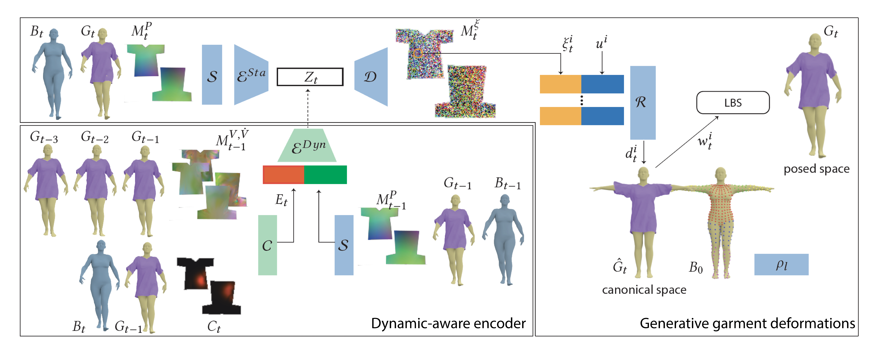

# Motion-Guided-Deep-Dynamic-3D-Garment

## Introduction

This repository contains the implemetation of [Motion-Guided-Deep-Dynamic-3D-Garment](https://geometry.cs.ucl.ac.uk/projects/2022/MotionDeepGarment/).
  
Our approach first learns a compact generative space of plausible garment deformations. We achieve this by encoding a garment geometry represented as relative to the underlying body to a latent code using a feature map encoder. A decoder then predicts a geometry feature map. We sample the feature map to obtain per-vertex geometry features. These features along with the vertex UV coordinates are provided to an MLP, to predict per-vertex canonical space displacements. We assign each vertex a skinning weight based on its proximity to the underlying body seed points weighted by a per-body part learnable kernel radius. Once a generative space of garment deformations are learned, we train a dynamic-aware encoder. We provide the previous garment geometry, the garment velocity, acceleration and the interaction between the body and the garment as input. The dynamic-aware encoder maps these inputs to a latent code in the learned deformation space which is then used to decode the current garment geometry. Blocks denoted in blue are pre-trained and kept fixed when training the blocks in green. More details, please refer to our [paper](https://arxiv.org/pdf/2209.11449.pdf).

## Results
  
We train our network on a walking sequence of 300 frames on a fixed body shape and test on
walking motion with different character armspace settings, different styles of walking, different body shapes, and even challenging dancing motions.

## Have fun!
If you want to setup your own training, you need to prepare the dataset composed of the mesh sequence of the body dynamics and the corresponding mesh sequence of garment dynamics. Then,
>>
>> To get the required information and saved in the folder of '/uv_body/' and '/uv_garment/', please refer the code in [./uv_rasterRender](https://github.com/MengZephyr/Motion-Guided-Deep-Dynamic-3D-Garment/tree/main/uv_rasterRender) 
>>
>> To get the sign distance field of the body shape at conanical post, please refer to [IGR: Implicit Geometric Regularization for Learning Shapes](https://github.com/amosgropp/IGR). 
>> 
>> To get the sequence in '/garment_pnva/', please refer to [garment_Data_Prep3.py](https://github.com/MengZephyr/Motion-Guided-Deep-Dynamic-3D-Garment)
>> 
>> To get the sequence in '/body_RTVN/', please refer to [body_Data_Prepare.py](https://github.com/MengZephyr/Motion-Guided-Deep-Dynamic-3D-Garment/tree/main/MotionGuidedDynamicGarment)
>> 
>> To train the static generative garment deformation network, please refer to [train_static_reconstruction.py](https://github.com/MengZephyr/Motion-Guided-Deep-Dynamic-3D-Garment/tree/main/MotionGuidedDynamicGarment)
>> 
>> To get the garment correponding latent code sequence, please refer to [run_static_reconstruction.py](https://github.com/MengZephyr/Motion-Guided-Deep-Dynamic-3D-Garment/tree/main/MotionGuidedDynamicGarment)
>> 
>> To train the dynamic encoder, please refer to [train_dynamic_prediction.py](https://github.com/MengZephyr/Motion-Guided-Deep-Dynamic-3D-Garment/tree/main/MotionGuidedDynamicGarment)
>> 
>> To rollout the dynamic prediction with collision handling, please refer to [run_dynamic_prediction.py](https://github.com/MengZephyr/Motion-Guided-Deep-Dynamic-3D-Garment/tree/main/MotionGuidedDynamicGarment)

We also provide some pretrained [checkpoint](https://drive.google.com/drive/folders/1OAr2XxGyqLWNGWdoHWetiSiDiNE1dtSQ?usp=sharing). You can play our code with our provided data, [here](https://drive.google.com/drive/folders/1cO0XUFXhWgwWvjNwB0xWr0SjrZSGfRO7?usp=sharing). 
